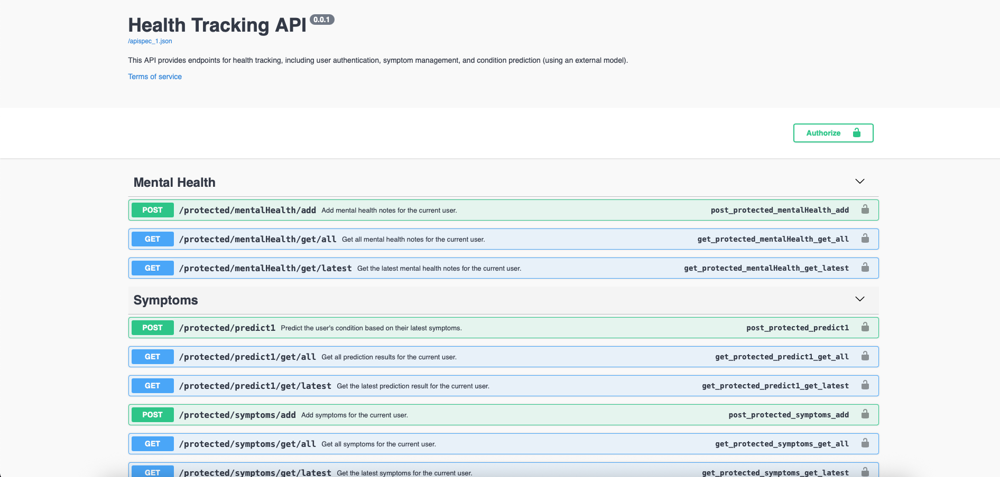

# Health Track AI API

## Description

This API is a tool used to track health. It tracks symptoms you may experience, then it can send those symptoms to an AI model to help predict the condition you may have (the model doesn't have 100% accuracy, and please don't take results fully seriously, consult a physician if you think something is wrong, or call emergency services). This API is can also be used for user auth and management, for a health tracking application. This API can also be used for mental health tracking (in the future there are plans to work with NLP for classification). HealthTrackAI API is built using Flask, it uses SQLAlchemy for database management, and Swagger for documentation. JWT Authentication and Bcrypt are used for security purposes, Bcrypt is used for password hashing, and JWT Authentication is used to keep user data secure, and accessible only to them.

## Purpose

- One purpose of this API is to **streamline the data storage process of symptom related data**, it ensures that the user can access their data from multiple devices. JWT authentication is used to keep their data safe and secure.
- Another purpose of this API is to interact with an **AI model that takes in symptoms that the user is experiencing, and outputs the condition they may have**. The AI model is hosted online on HF Spaces using the free-tier option, which has limited computational resources. As a result of this the space has been made private so that others cannot misuse the model, this API interacts with the model, and it helps ensure that the details for the space remain private.

## Swagger Documentation

Swagger documentation exists for this API. Swagger can be used to test the functionality of this API.

## Databases

There are 4 tables used by this API to store information:

- User
- Symptoms
- Predict1Results
- MentalHealthNotes

The user database stores information about the user such as username, email, password, number of tokens, and id.
The symptoms database stores id (Symptom id), user id, datetime of creation, and the list of symptoms.
Prediction results database #1 stores the results after making predictions using model #1.
The mental health notes database stores the notes/logs the user can make about their mental health status.

## Routes

- Register, to create a new user (POST)
- Login, to login a registered user and get JWT Key (POST)
- Update Tokens, to update the number of tokens the user has (each user will have a limited number of tokens which correspond to predict API calls), (PUT)
- Delete User, deletes the current user, (DELETE)
- Get User Info fetches all the user info like username, password, email, and number of tokens. (GET)
- Add Symptoms, add the symptoms that you are experiencing (POST)
  - Format for adding symptoms
    - Binary, only zeroes or ones which represent experiencing or not experiencing a symptom
    - The order, integers, and number of integers correspond to the model that you are using, the model I worked with had 377 integers where each integer, 0/1 would represent having or not having a symptom
- Get latest symptom, since symptom you can create multiple symptom logs, and they don't override each other, this GET request will just get the latest one. (GET)
- Get all symptoms, this GET request gets all the symptoms you have logged in the past. (GET)
- Predict1, this POST request sends your latest symptom log to the AI Model, and saves the response, the prediction to a database. (POST)
- Get Latest Prediction fetches the result from the latest prediction. (GET)
- Get All Predictions gets the results from all predictions made. (GET)
- Get time UTC, mostly used for testing purposes (GET)
- Get time, Eastern, mostly used for testing purposes (GET)
- Add Mental Health Note, log your feelings at the moment (POST)
- Get Latest Mental Health Note (GET)
- Get all Mental Health Notes (GET)

**If you are trying to test the predict model, please use this sample input**, to ensure the model (that the API calls) doesn't throw an **error**:
[1, 0, 0, 0, 0, 0, 0, 0, 0, 0, 0, 0, 0, 0, 0, 0, 0, 0, 0, 0, 0, 0, 0, 0, 0, 0, 0, 0, 0, 0, 0, 0, 0, 0, 0, 0, 0, 0, 0, 0, 0, 0, 0, 0, 0, 0, 0, 0, 0, 0, 0, 0, 0, 0, 0, 0, 0, 0, 0, 0, 0, 0, 0, 0, 0, 0, 0, 0, 0, 0, 0, 0, 0, 0, 0, 0, 0, 0, 0, 0, 0, 0, 0, 0, 0, 0, 0, 0, 0, 0, 0, 0, 0, 0, 0, 0, 0, 0, 0, 0, 0, 0, 0, 0, 0, 0, 0, 0, 0, 0, 0, 0, 0, 0, 0, 0, 0, 0, 0, 0, 0, 0, 0, 0, 0, 0, 0, 0, 0, 0, 0, 0, 0, 0, 0, 0, 0, 0, 0, 0, 0, 0, 0, 0, 0, 0, 0, 0, 0, 0, 0, 0, 0, 0, 0, 0, 0, 0, 0, 0, 0, 0, 0, 0, 0, 0, 0, 0, 0, 0, 0, 0, 0, 0, 0, 0, 0, 0, 0, 0, 0, 0, 0, 0, 0, 0, 0, 0, 0, 0, 0, 0, 0, 0, 0, 0, 0, 0, 0, 0, 0, 0, 0, 0, 0, 0, 0, 0, 0, 0, 0, 0, 0, 0, 0, 0, 0, 0, 0, 0, 0, 0, 0, 0, 0, 0, 0, 0, 0, 0, 0, 0, 0, 0, 0, 0, 0, 0, 0, 0, 0, 0, 0, 0, 0, 0, 0, 0, 0, 0, 0, 0, 0, 0, 0, 0, 0, 0, 0, 0, 0, 0, 0, 0, 0, 0, 0, 0, 0, 0, 0, 0, 0, 0, 0, 0, 0, 0, 0, 0, 0, 0, 0, 0, 0, 0, 0, 0, 0, 0, 0, 0, 0, 0, 0, 0, 0, 0, 0, 0, 0, 0, 0, 0, 0, 0, 0, 0, 0, 0, 0, 0, 0, 0, 0, 0, 0, 0, 0, 0, 0, 0, 0, 0, 0, 0, 0, 0, 0, 0, 0, 0, 0, 0, 0, 0, 0, 0, 0, 0, 0, 0, 0, 0, 0, 0, 0, 0, 0, 0, 0, 0, 0, 0, 0, 0, 0, 0, 0, 0, 0, 0, 0, 0, 0, 0, 0, 0, 0, 0, 0, 0, 0, 0, 0, 0, 0]

## Predict Model

The model used for predict1 hasn't been publicly released yet, because it is incomplete. The model is called SympAPI and is used to predict illnesses based on the symptoms that the user is experiencing. SympAPI uses a Long-Short Term Memory Deep Neural Network (LSTM-DNN, soon Bidirectional), the Adam Optimizer, Cross Entropy Loss, and the PyTorch Framework. The current idea I have is to connect this model to a UI using this API, and add user management functionality to the application.

## YSWS Requirements

- 3 GET - Done
- 3 POST - Done
- 1 DELETE - Done
- 1 PUT - Done
- JWT Authentication - Done
- Database - Done
- Swagger Documentation - Done
- 8 Hours Time Spent (7.75/8)

## Swagger Images

## Thank you for reading!
